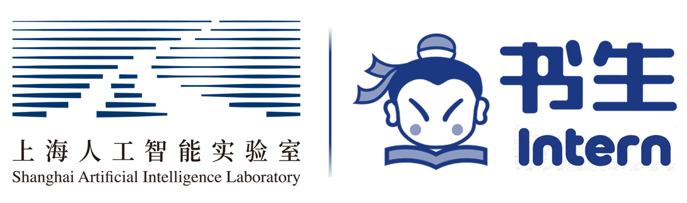
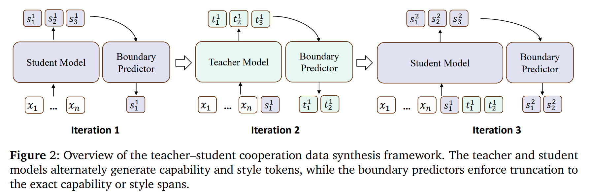
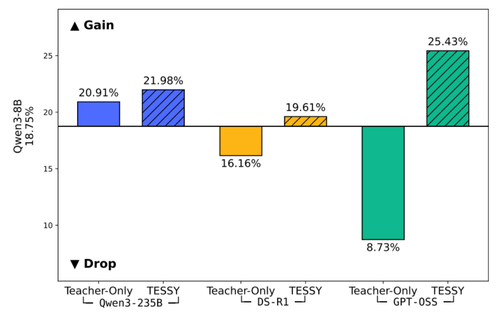

<table align="center">
  <tr>
    <td align="center" style="padding-right: 30px;">
      <!-- Project Logo (Square) -->
      
    </td>
    <td align="left">
      <h1 style="margin: 0;">How to Fine-Tune a Reasoning Model?<br>A Teacher–Student Cooperation Framework to Synthesize Student-Consistent SFT Data</h1>
      <p style="margin: 0; font-size: 1.1em;"><em>On-policy Data Synthesis for Reasoning Models</em></p>
    </td>
  </tr>
</table>

<p align="center" style="margin-top: 15px; margin-bottom: 30px;">
  <!-- Company Logo (Rectangular) - Now below project title, centered -->
  
</p>

<p align="center">
  📄 <a href="https://github.com/CoopReason/TESSY/blob/main/paper/TESSY.pdf">Paper Link</a>
  &nbsp;&nbsp;&nbsp;|&nbsp;&nbsp;&nbsp;
  🤗 <a href="https://huggingface.co/datasets/CoopReason/TESSY-Code-80K">Training Set for Code Generation</a>
</p>

---


## 🚀 Overview

Training reasoning models (e.g., Qwen3) is highly sensitive to the data distribution. We observe that:

> ❗ Using off-policy data (e.g., directly from a strong teacher model) for SFT can lead to **severe catastrophic forgetting**, especially for complex reasoning tasks.

---

## 💡 Key Idea

To address this critical issue, we propose **TESSY**, a novel **Teacher–Student Cooperative Data Synthesis framework** designed to generate *on-policy* training data. Instead of relying on a teacher model to fully generate training samples, TESSY **decouples the generation process into two distinct parts**:

- 🧠 **Teacher model** → specializes in generating  *reason tokens*.
- ✍️ **Student model** → focuses on generating *style tokens* (e.g., Hmm, Wait...).

This cooperative approach ensures:

-   **Alignment with student distribution (on-policy)**: The synthesized data is tailored to the student model's own generation patterns.
-   **Preservation of teacher reasoning quality**: The teacher's advanced reasoning capabilities are effectively leveraged and maintained.

---

## 🧩 Method

<div align="center">
  
</div>

TESSY performs **iterative cooperative generation** through the following steps:

1.  **Predict Reasoning Boundaries**: The process begins by identifying the boundaries between reasoning steps and non-reasoning content within a given problem.
2.  **Alternate Generation**: The teacher and student models then alternate in generating parts of the solution.
3.  **Construct Full Trajectories**: By combining these collaboratively generated segments, TESSY constructs complete, high-quality reasoning trajectories that are aligned with the student model's distribution.

---

## 📊 Results

<div align="center">
  
</div>

Our experimental results demonstrate the effectiveness of TESSY:

-   Direct SFT using **GPT-OSS-120B data** (Teacher-Only approach) consistently leads to **❌ severe catastrophic forgetting**, significantly degrading performance on target tasks.
-   Data synthesized using **TESSY** achieves **✅ significant improvement** on code generation benchmarks, effectively mitigating catastrophic forgetting and boosting student model performance.

---

## 📦 Released Dataset

We are pleased to release the dataset used in our paper to facilitate further research:

-   **Name:** [TESSY-Code-80K](https://huggingface.co/datasets/CoopReason/TESSY-Code-80K)
-   **Designed for:** Optimally tailored for Qwen3-8B.
-   **Effect:** TESSY demonstrates significant improvements across various code generation tasks for Qwen3-8B. Performance metrics are summarized below:

| Benchmark |       Qwen3-8B       | Training on [TESSY-Code-80K](https://huggingface.co/datasets/CoopReason/TESSY-Code-80K) | Improvement |
| :-------- |:--------------------:|:---------------------------------------------------------------------------------------:|:-----------:|
| LCB-V5    |        55.09%        |                                       **62.87%**                                        |   ↑ 7.78%   |
| LCB-V6    |        49.58%        |                                       **55.43%**                                        |   ↑ 5.85%   |
| LCB-Pro   |        25.35%        |                                       **36.69%**                                        |  ↑ 11.34%   |
| OJBench   |        18.75%        |                                       **25.43%**                                        |   ↑ 6.68%   |

> **Note:** While this dataset can be applied to other Qwen3 models, the performance gains may vary as the synthesis process was specifically tailored and optimized for Qwen3-8B.

---

## ⚙️ Setup & Usage

### 1. Start Model Servers

First, you need to start the API servers for both your teacher and student models. Record their API endpoints (IP address + port). Adjust the following parameters based on your hardware setup and resource availability:

-   `TP` (Tensor Parallelism)
-   `GPU_MEM_UTILIZATION`

### 2. Prepare Boundary Predictors

We provide trained boundary predictors for your convenience:

-   `CoopReason/Boundary_Predictor_Teacher_Code`
-   `CoopReason/Boundary_Predictor_Student_Code`

Alternatively, you can train your own boundary predictors by running the script in:
`bash Boundary_Predictor/`

### 3. Run TESSY

Once your model servers are running and boundary predictors are ready, you can execute TESSY using the provided script:

```bash
bash run_tessy.sh \
  datas/examples.jsonl \
  results/example_outputs.jsonl \
  http://127.0.0.1:23333/v1/completions \
  http://127.0.0.1:23334/v1/completions
```


-   **Example Input:** `datas/examples.jsonl` (a subset of OJBench)
-   **Output:** `results/example_outputs.jsonl` will contain the synthesized data.

---

## ⚠️ Notes

This repository currently represents a **research prototype (demo version)**. It is built on top of `vLLM` to leverage its efficient serving capabilities.

Further improvements are actively being explored in areas such as:

-   Inference efficiency
-   Scheduling strategies
-   Batching optimization

---

## 🤝 Contact & Future Work

We are continuously working to improve TESSY and warmly welcome:

-   **Feedback:** Your insights are invaluable for enhancing the framework.
-   **Collaboration:** We are open to research collaborations.
-   **Real-world Deployment Discussions:** Interested in applying TESSY to practical scenarios? Let's talk!

Feel free to reach out to us!
**Email:** huangzixian@pjlab.org.cn

---

## 📌 Citation

Due to unforeseen reasons, our paper has been on-hold on arXiv for an extended period, and we are actively working with arXiv to resolve this issue. Currently, we have uploaded the paper to GitHub. Until our paper is officially released on arXiv, please cite our work as follows when using our dataset:

```bibtex
@article{TESSY,
  title={How to Fine-Tune a Reasoning Model? A Teacher--Student Cooperation Framework to Synthesize Student-Consistent SFT Data},
  author={Zixian Huang, Kaichen Yang, Xu Huang, Feiyang Hao, Qiming Ge, Bowen Li, He Du, Kai Chen and Qipeng Guo.}, 
  year={2026},
  howpublished={\url{https://github.com/CoopReason/TESSY/blob/main/paper/TESSY.pdf}},
  note={Preprint. Available on GitHub.}
}
```
We kindly request that once our paper is published on arXiv, you update your citations to reference the official arXiv version. Thank you for your understanding and support!
